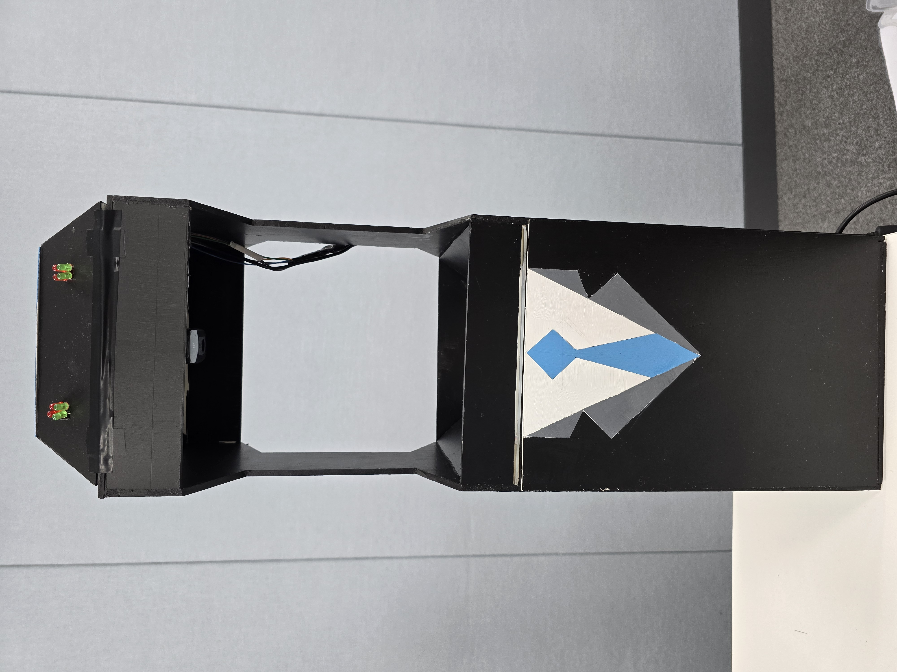

# BOSS

 <div align="center" style="padding-bottom: 40px;">
     
</div>

## 목차

1. [프로젝트 개요](#프로젝트-개요)
2. [프로젝트 소개](#프로젝트-소개)
3. [프로젝트 산출물](#프로젝트-산출물)
4. [팀원 구성 및 역할 분담](#팀원-구성-및-역할-분담)
5. [회고](#회고)
6. [개발 환경](#개발-환경)

## 프로젝트 개요

- **프로젝트 기획 배경**
    - 보안이 중요한 사업장이나 기관에서는 보안 스티커가 필수적입니다. 이 스티커는 문서, 장비, 시설의 무결성을 확인하고 외부의 불법 접근이나 변조를 방지하는 중요한 역할을 합니다. 하지만 특정 시간대에 많은
      인파가 몰리면 사람이 스티커 상태를 신속하고 정확하게 확인하기 어려워, 실수가 발생할 수 있습니다. 이러한 인적 오류는 보안 체계에 큰 문제를 초래할 수 있습니다.
      이를 해결하기 위해, 저희는 YOLO를 활용한 보안 스티커 검사 기기 제작 프로젝트를 기획했습니다. 이 기기는 보안 스티커의 상태를 자동으로 판별하고, 이상이 감지되면 즉시 경고를 발송해 인적 오류를
      방지합니다. 이로써 보안 현장의 효율성과 안전성을 크게 개선할 수 있을 것입니다.


- **프로젝트 목표**
    - 이번 프로젝트의 주요 목표는 두 가지입니다. 첫째, 기존에 인력을 통해 수행되던 보안 스티커 부착 및 부착 여부 판별 과정을 자동화하는 것입니다. 이를 통해 인적 오류를 최소화하고, 보안 절차의 효율성을
      크게 향상시킬 수 있습니다.
    - 둘째, 입출입 기록과 함께 보안 스티커의 부착 상태를 데이터로 저장하여 활용하는 것입니다. 이러한 데이터를 분석함으로써 보안 관리의 신뢰성을 높이고, 향후 보안 강화 전략 수립에 중요한 자료로 사용할 수
      있습니다.

- **주요 기능**
    - YOLO v8 모델을 활용하여 카메라 보안스티커 부착 여부 검사, 부착 상태 확인, 스티커 개수 확인
    - NFC로 사용자를 인식
        - 휴대폰 검사와, 게이트 출입/퇴장을 동시에 수행
            - 만일 스티커 상태가 불량하거나, 미부착 상태라면 경고
        - 검사 후 검사 이미지를 비롯한 정보들을 서버에 로깅
    - 관리자 페이지에서 관리자가 다양한 기능을 수행
        - 실시간 로그 조회
        - 전체 로그 조회
        - 멤버 등록
        - 멤버 조회
        - 통계 데이터 조회
    - 실시간 모니터링 기능 제공
- **개발 기간**
    - 2024-07-08 ~ 2024-08-16 (6주)

## 프로젝트 소개

### 관리자 페이지

- 로그인 화면
  <div align="center">
  
  </div>

    ```
    1. 주어진 관리자 아이디와 관리자 비밀번호를 입력하여 로그인을 할 수 있습니다.
    ```

- 메인 페이지
    <div align="center">
    
    </div>
    <div align="center">
    
    </div>

    ```
    1. 당일 이슈 요약, 이슈 통계를 한 눈에 볼 수 있습니다.
    2. 실시간 적발 이슈를 확인할 수 있습니다.
    3. 간단한 이슈 조치 사항을 확인할 수 있습니다.
    ```

- 조회 페이지
    <div align="center">
    
    </div>
    <div align="center">
    
    </div>
    <div align="center">
    
    </div>

    ```
    1. 전체 로그, 혹은 특정 로그를 볼 수 있습니다.
    2. 간편 검색 혹은 상세 검색으로 보고 싶은 로그를 특정할 수 있습니다.
    3. 각 로그의 휴대폰 사진을 확인할 수 있습니다.
    4. 기기 오류로 보안 이슈가 잘못 로깅됐다면 수정할 수 있습니다. 
    ```

- 통계 페이지
    <div align="center">
    
    </div>
    <div align="center">
    
    </div>
    <div align="center">
    
    </div>

    ```
    1. 통계 요약에서 원하는 날짜의 통계 요약 데이터를 볼 수 있습니다.
    2. 날짜별 통계에서 원하는 날짜의 통계 상황을 그래프로 확인할 수 있습니다.
    3. 통합 통계에서 원하는 날짜에 보고 싶은 게이트, 혹은 부서들의 데이터를 확인할 수 있습니다.
    3.1. 게이트별 보기, 혹은 부서별 보기 옆 모달로 원하는 만큼 모집단을 선택할 수 있습니다.
    ```

- 관리 페이지
    <div align="center">
    
    </div>
    <div align="center">
    
    </div>
    <div align="center">
    
    </div>

    ```
    1. 관리자는 단일 이용자를 등록할 수 있고, CSV파일이 주어진다면 일괄 등록도 가능합니다.
    2. 간편 검색 혹은 상세 검색으로 보고 싶은 이용자를 특정할 수 있습니다.
    ```

- 다크모드 지원
    <div align="center">
    
    </div>
    <div align="center">
    
    </div>

    ```
    1. 우하단의 설정탭을 열어서 다크모드를 on/off 할 수 있습니다.
    ```

- 영어 지원
    <div align="center">
    
    </div>

    ```
    1. 우하단의 설정탭을 열어서 언어를 영어로 변경할 수 있습니다.
    ```

- 출석체크 기능
    <div align="center">
    
    </div>

    ```
    1. 만일 출입 로그가 찍히면 자동으로 출석(출근)처리가 됩니다.
    ```

### 기계 설계도
<div align="center">

</div>

### 작업 사진
<div align="center">

</div>
<div align="center">

</div>
<div align="center" style="padding-bottom: 40px;">

</div>

### 완성품
<div align="center" style="padding-bottom: 40px;">

</div>

### 기기 결선도
<div align="center" style="padding-bottom: 40px;">

</div>

### 동작 원리
1. NFC를 인식하여 시스템을 활성화합니다.
2. 두 개의 카메라를 통해 휴대폰의 상태를 확인합니다.
3. 스티커가 올바르게 부착된 경우, 초록색 LED가 점멸하고 통과음이 재생됩니다.
4. 스티커에 이상이 있는 경우, 빨간색 LED가 점멸하고 경고음이 재생되며, 서보 모터가 차단봉을 내려 통과를 막습니다.
5. 휴대폰 판별 전에 사람이 지나갈 경우, 초음파 센서가 이를 인식하여 서보 모터가 차단봉을 내려 통과를 차단합니다.

- **이상 없음**:
    - NFC 인식 후, 카메라가 휴대폰 상태를 확인합니다.
    - 스티커가 올바르게 부착된 경우, 초록색 LED가 점멸하며 통과음이 재생됩니다.
    - 차단봉이 열리며 통과가 허용됩니다.
- **이상 발생**:
    - NFC 인식 후, 카메라가 휴대폰 상태를 확인합니다.
    - 스티커에 이상이 감지되면, 빨간색 LED가 점멸하고 경고음이 재생됩니다.
    - 차단봉이 내려가며 통과가 차단됩니다.
- **판단 전 통과 시**:
    - NFC 인식 후, 휴대폰 판별 전에 사용자가 지나가려고 하면, 초음파 센서가 이를 감지합니다.
    - 서보 모터가 차단봉을 내려 통과를 막으며, 경고음이 재생됩니다.

### 동작 소개

- 이상 없음

  <div align="center">
      
  </div>

- 이상 발생

  <div align="center">
     
  </div>

- 판단 전 통과시

  <div align="center">
    
  </div>

## 프로젝트 산출물

- **플로우 차트**

 <div align="center" style="padding-bottom: 40px;">
     
</div>

- **아키텍처**

 <div align="center" style="padding-bottom: 40px;">
     
</div>

- **ERD**

 <div align="center" style="padding-bottom: 40px;">
     
</div>

- **목업**

<div align="center" >
     
</div>

 <div align="center" >
     
</div>

 <div align="center" >
     
</div>
 <div align="center" >
     
</div>
 <div align="center" style="padding-bottom: 40px;">
     
</div>

- **[포팅 매뉴얼](./exec/포팅매뉴얼.md)**

## 협업 환경

- Git Strategy
    - Git Flow 전략 사용하였고, 크게 Master, Develop, Feature 브랜치로 나누어서 사용.
    - Master Branch
        - Master Branch는 출시 가능한 코드를 모아두는 브랜치이다. Master 브랜치는 프로젝트 시작 시 생성되며, 개발 프로세스 전반에 걸쳐 유지된다.
    - Develop Branch
        - 다음 버전 개발을 위한 코드를 모아두는 브랜치. 개발이 완료되면 Master 브랜치로 머지한다.
    - Feature Branch
        - 하나의 기능을 개발하기 위한 브랜치. Develop 브랜치에서 생성하며, 기능이 개발 완료되면 다시 Develop 브랜치로 머지한다. 이때 Merge Commit을 생성하며 머지를 해주어서
          히드토리가 특정 기능 단위로 묶이게 했다. 네이밍은 feat/FE/branch-name 혹은 feat/AI/branch-name 처럼 feat/역할/브랜치-name 규칙을 따랐다.
- [Git Covention](https://www.notion.so/Git-Convention-badde840a3b34a379d358695ca538fea?pvs=21)
- [Jira](https://www.notion.so/daftenp/JIRA-Rule-e1ad2fba02414843ab758bf0eafdc5ac?pvs=4)
- Notion
    - 마인드 셋, 기획서, 명세서, 일일회고, 회의록 등 기록들을 노션에 우선 정리
        - 회의록 : 회의를 하거나, 컨설팅, 피드백을 받으면 회의록을 작성
        - Rule: 코딩 컨벤션, Jira 작성법을 노션에 적어 규칙을 먼저 정하고 개발
        - 산출물 : 기획서, 요구사항 명세서, 기능 명세서, API 규격서 등 산출물을 노션에 정리

## 팀원 구성 및 역할 분담

<table>
    <tr>
        <td align="center"><a href="https://github.com/DaftenP">박지용</a></td>
        <td align="center"><a href="https://github.com/Khs-NA">강현성</a></td>
        <td align="center"><a href="https://github.com/SlowCloud">서정운</a></td>
        <td align="center"><a href="https://github.com/mango152">조원빈</a></td>
        <td align="center"><a href="https://github.com/everev1">김지환</a></td>
        <td align="center"><a href="https://github.com/there2989">노재훈</a></td>
    </tr>
    <tr>
        <td align="center"><a href="https://github.com/DaftenP"><sub></sub></a></td>
        <td align="center"><a href="https://github.com/Khs-NA"><sub></sub></a></td>
        <td align="center"><a href="https://github.com/SlowCloud"><sub></sub></a></td>
        <td align="center"><a href="https://github.com/mango152"><sub></sub></a></td>
        <td align="center"><a href="https://github.com/everev1"><sub></sub></a></td>
        <td align="center"><a href="https://github.com/there2989"><sub></sub></a></td>
    </tr>
    <tr>
        <td align="center"><b>팀장(PM), AI, Embedded</b></td>
        <td align="center"><b>Embedded</b></td>
        <td align="center"><b>Backend, Infrastructure</b></td>
        <td align="center"><b>Backend</b></td>
        <td align="center"><b>Frontend</b></td>
        <td align="center"><b>Frontend</b></td>
    </tr>
</table>

#### 박지용 - 팀장(PM), AI, Embedded

- YOLO v8 모델을 Fine-tuning하여 객체 탐지 모델 구성
- 객체 탐지 모델을 활용하여 보안 스티커 부착 확인 로직 구현
- 실시간 모니터링 GUI를 구성(PyQt 사용)
- NFC 태그 시 사용자 정보 및 로그 조회 통신 구현
- 보안 스티커 부착 여부에 따른 게이트 조작 신호 보내기 및 로그 데이터 통신 구현

#### 강현성 - Embedded

- Raspberry Pi 5 및 Jetson Orin Nano의 개발 환경 구축 (OpenCV, YOLO, SSH 설정)
- Raspberry Pi와 Jetson Orin Nano 간의 UART 통신 프로토콜 설정 및 최적화
- NFC 모듈(PN532)의 I2C 통신 설정 및 Raspberry Pi와의 인터페이스 구축
- 초음파 센서(HC-SR04), 서보모터(MG996R), LED 및 스피커의 동작 로직 설계 및 구현
- 모든 모듈의 회로 설계 및 연결, 기기 외부 프레임 제작 및 통합

#### 서정운 - Backend, Infrastructure

- NGINX SSL 설정
- 도커 이미지 빌드 및 백업
- 젠킨스를 통한 CI/CD 컨테이너 배포
- 도커파일 빌드 캐싱 최적화
- 젠킨스 병렬 처리
- 백엔드 코드 리팩터링
- 백엔드/인프라 통합 디버깅
- AOP 활용한 컨트롤러 로깅
- 백엔드 테스트 코드 작성
- 백엔드 예외처리 및 ProblemDetails 관리
- 스프링 시큐리티 필터 관리
- 데이터베이스 관리

#### 조원빈 - Backend

- JWT를 활용한 로그인 구현
- AWS S3연동 및 CDN 처리, 이미지 저장, 이미지 크기 조정 구현
- 로그 조건 서치를 위한 동적 쿼리 작성
- 로그 처리 알림을 위한 SSE 통신 구현
- ERD 기반 Entity 작성
- 로그, 멤버 저장 및 서치 구현

#### 김지환 - Frontend

- UI/UX 설계
- 필터링 기능 구현
- useEffect와 useState를 이용한 더보기 기능 구현
- 로그 조회 페이지 구현
- 모니터링 페이지 디자인 설계
- 에듀싸피, 에듀싸피 로그인 페이지 디자인 제작
- useEffect와 dispatch, 정렬을 이용한 에듀싸피 자동 입실체크 기능 구현

#### 노재훈 - Frontend

- 로고 제작
- UI/UX 설계
- 클라이언트 구조 설계
- axios를 활용하여 서버와 통신 구현
- JWT를 활용한 로그인 구현
- 폴리필 패키지를 활용하여 SSE 수신 구현
- 웹페이지 다크 모드 구현
- i18n를 활용하여 다국어 지원 구현
- 메인, 통계, 관리 페이지 구현

## 회고

> 박지용

“많은 것을 배울 수 있었던 프로젝트”

말도 많고 탈도 많았던 6주 간의 프로젝트가 마무리 되었습니다. AIoT는 도전적인 분야였습니다. "기계 다루는 게 뭐 별게 있겠어?"라는 생각으로 덜컥 뛰어들었지만, 그 생각은 그리 오래가지 않았습니다. 오늘 잘
작동하던 기기가, 코드가, 내일이 되어서는 고장나버리는 경험들을 겪기도 하고, 기획한 것에서 대거 변경점이 발생하기도 하고, 기대한 만큼 성능이 잘 나오지 않는 고초도 겪었습니다. 이런 것들이 발목을 잡아, 계획을
더디게 만들기도 했죠. 프로젝트 최종 발표 직전까지도 행여나 시연이 잘 안되지는 않을까, 노심초사하며 테스트를 해봤던 것이 기억에 남습니다. 그럼에도 결국, 함께였기에 성공적으로 마무리 할 수 있었던 것 같습니다.
함께 희노애락하며 열심히 참여해준 팀원들에게 감사한 마음을 전합니다. 각자 맡은 자리에서 저마다의 역할을 훌륭히 수행해 주었다고 생각합니다. 다들 고생 많으셨습니다!

> 서정운

싸피에서의 첫 협업 프로젝트가 무사히 끝나 다행이라고 생각합니다.

도커와 젠킨스를 통해 CI/CD 배포를 진행하면서 데브옵스의 매력을 새로이 알 수 있는 기회가 되어 좋았습니다. IoT 프로젝트였던 만큼 백엔드/인프라의 규모가 적어 아쉬웠지만, 그만큼 기본적인 내용에 집중할 수
있는 기회가 되었습니다.

프로젝트에 열심히 참여해준 열정 있는 팀원들과 함께할 수 있어서 기뻤습니다. :))

> 조원빈

첫 프로젝트를 성공적으로 마무리하여 너무 기쁩니다.

이번에 백엔드를 맡으면서 배워야 할게 많아 걱정을 많이 했었는데 웹 기술에 비해 백엔드 규모가 상대적으로 적어서 공부를 하면서 개발을 하기에 충분한 분량이었다고 생각됩니다.

또한 JIRA 같은 협업 툴을 처음 사용해보았는데 덕분에 협업 툴을 사용해가면서 팀원과 협업을 하는 방법을 알아간거 같습니다.

이번 프로젝트를 기반으로 앞으로 있을 프로젝트도 잘 수행해나가겠습니다. 같이 고생한 팀원들에게 감사인사를 보냅니다.

> 김지환

전공자와 비전공자가 함께하는 6인 프로젝트를 성공적으로 마무리되어 뜻깊습니다.

JIRA라는 협업 tool을 사용하여 일정 관리를 효율적으로 하였고, GitLab 관련해서도 Git convention 을 정하여 형상 관리 또한 효율적으로 할 수 있었습니다. 개발을 하기 전 기획부터 요구사항
명세서, 기능 명세서, API 연동 규격서, ERD, 와이어프레임 등 산출물을 제작하면서 개발 전 기획과 설계를 통한 기초를 탄탄히 다지는 과정이 중요함을 느낄 수 있었습니다.

Frontend 역할을 맡아서 React라는 처음 접하는 라이브러리를 사용하였습니다. AIoT 프로젝트여서 Web 비중이 크지 않았기에 학습하면서도 동시에 개발할 수 있었던 것 같습니다. 웹 디자인 측면에서 코치님께
지속적으로 피드백을 받으며 UI, UX에 초점을 맞춰 개발하였습니다. 다만, 기능 구현에 집중을 한 나머지 컴포넌트의 재사용성과 코드 최적화를 신경 쓰지 못한 점이 아쉽습니다.

처음 접해보는 스크럼을 매일 수행하면서 팀원들과 진행 상황에 대해 공유하고 앞으로 할 일과 진행 방향성에 대해 소통하는 시간을 많이 가졌습니다. 그 덕에 프로젝트를 성공적으로 마무리할 수 있었습니다. 모르는 부분을
항상 친절하게 알려주며 멋진 팀워크를 보여준 팀원들에게 감사함을 느낍니다. 이 경험을 토대로 한 걸음 더 나아가는 개발자가 되겠습니다.

> 강현성

해보았던 프로젝트 중 가장 많은 인원으로 진행했던 프로젝트입니다.

디바이스, 웹, 인프라, 데이터 등등 고려해야 할 요소가 많았지만, 각자 역할 분담을 통해서 자신의 업무에만 집중할 수 있는 환경이 프로젝트의 몰입도를 증가시켜 주었습니다.

장비관련 이슈가 상당히 많이 터졌지만, 발생한 이슈만큼 해결한 경험도 쌓여 앞으로의 양분이 될 거 같습니다. 사소한 부분까지 팀원들과 소통하는 필요성을 느낄 수 있었기에 회고의 마지막을 팀원들에 대한 감사로 마무리
하겠습니다. 모두들 6주간 감사했습니다!

> 노재훈

인원이 많은 프로젝트는 처음이었고, 비전공자인 입장으로서 기획 단계부터 각 잡고 설계해 프로젝트를 진행한 프로젝트도 처음이었습니다.

프론트 엔드에서 가장 많이 쓰이는 리액트도 이번 프로젝트를 통해 접하게 되었고, 배포되는 서버와의 통신도 처음 구현해 보았는데, 각종 에러에 시달리면서 고생했지만 그만큼 배워가는 게 많았습니다.

또한 Jira와 Git 규칙을 꼼꼼하게 정하고 적극적으로 활용하여 스케줄 관리를 하여 개발 일정에 큰 문제가 생기지 않도록 하였는데, 이것으로 스케줄 관리의 중요성을 깨닫게 되었습니다.

다만 AIoT가 주제임에도 불구하고 AI와 IoT에는 거의 신경을 쓰지 못하고 클라이언트 쪽만 제작하였는데, 웹 기술이나 웹 디자인에 비해 규모가 작고 프론트 엔드가 활약하는 프로젝트가 아니다 보니 아쉬움이
컸습니다. 다음에는 조금 더 프론트 엔드의 지식이나 스킬들을 많이 배워가는 프로젝트를 진행하여 얻어가는 게 많았으면 좋겠습니다.

## 개발 환경

### Management Tool

   

### IDE

  

### Infra

 

### DB

 

### Backend

    

### Frontend

     

### Embedded

 

### AI


