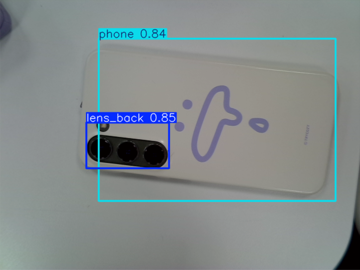
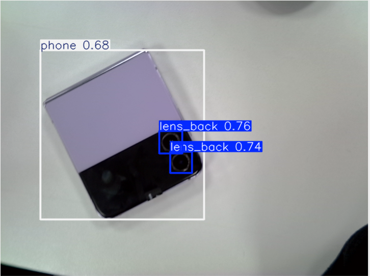
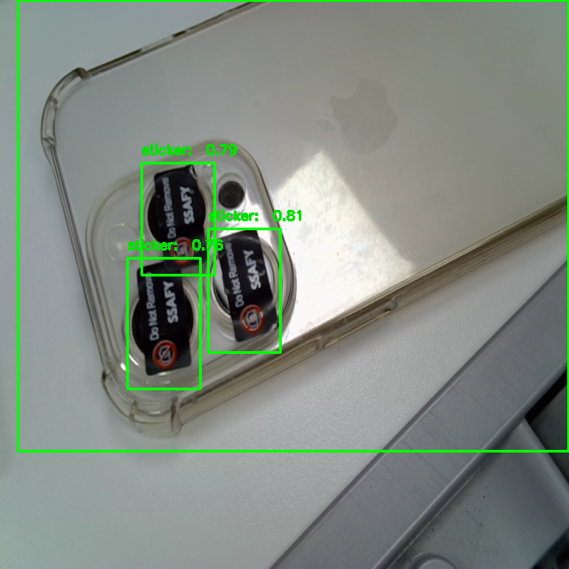

# YOLO v8 학습 코드

[코드](./YOLOv8_Object_Detection_Camera_Lens_Dataset.ipynb)

[학습 데이터](https://universe.roboflow.com/daftenp/camera-lens-detection)

## 24-07-22

### Summary

- Dataset split ratio : Train 1131 / Valid 113 / Test 54
- Preprocessing : Auto-Orient / Resize: Stretch to 1280\*1280
- Augmentation : 90° Rotate: Clockwise, Counter-Clockwise, Upside Down

### Hyperparameter

- epochs=100
- patience=30
- batch=32
- imgsz=416

### Comment

- 현재 후면 카메라 렌즈는 제법 잘 탐지 되는 상태.
- 예제 코드에서 별다른 하이퍼 파라미터 튜닝을 수행하지 않았음.
- 데이터 전처리도 고민해볼 것.

초기버전(07-21)

후면 카메라 학습 버전(07-22)

---

## 24-07-23

### Summary

- Dataset split ratio : Train 1680 / Valid 156 / Test 75 (스티커 부착 이미지 데이터 추가)
- Preprocessing : Auto-Orient / Resize: Stretch to 1280\*1280
- Augmentation : 90° Rotate: Clockwise, Counter-Clockwise, Upside Down

### Hyperparameter

- epochs=100
- patience=30
- batch=16
- imgsz=1280

### Commnet

- 학습 시간이 대략 4 ~ 5시간이 걸려서 성능 테스트를 해보지 못함
- 이미지 사이즈를 1280 으로 늘렸는데, 이가 유의미한 성능 차이를 보여줄 지 의문
  - 관련 논문 찾아볼 예정.

## 24-07-24

### Summary

- Dataset split ratio : Train 1680 / Valid 156 / Test 75 (스티커 부착 이미지 데이터 추가)
- Preprocessing : Auto-Orient / Resize: Stretch to 1280\*1280
- Augmentation : 90° Rotate: Clockwise, Counter-Clockwise, Upside Down

### Hyperparameter

- epochs=100
- patience=30
- batch=16
- imgsz=640

### Commnet

- 적은 데이터로도 꽤나 준수한 성능을 보여줌
- 아직 스티커를 떼었다 붙인 경우를 잘 판별하지 못함 -> 데이터 증량

보안스티커 학습 버전(07-24)

