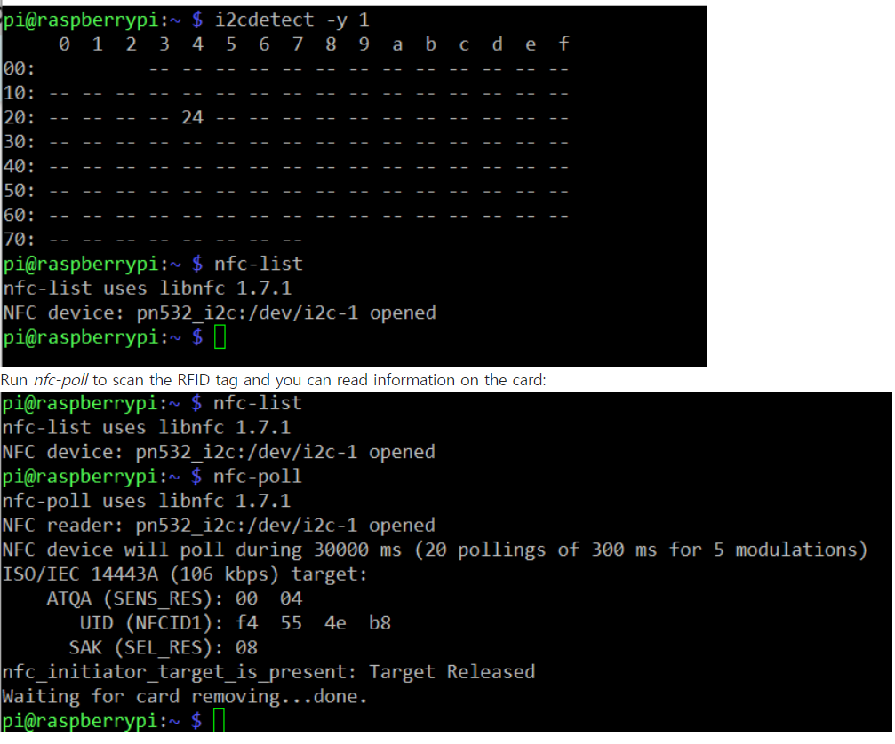

# NFC 리더 동작하기
`https://github.com/hoanhan101/pn532?tab=readme-ov-file`

`https://github.com/nfc-tools/libnfc/releases/tag/libnfc-1.7.1`

# 1.Pi 설정 변경하기
`sudo raspi-config`
- Interfacing Options -> I2C -> yes.

2. 패키지 설치

sudo apt-get update
sudo apt-get install libusb-dev libpcsclite-dev i2c-tools
3. Download and unzip the source code package of libnfc

cd ~
wget http://dl.bintray.com/nfc-tools/sources/libnfc-1.7.1.tar.bz2
`주소는 위에 libnfc-1.7.1로 변경`
tar -xf libnfc-1.7.1.tar.bz2 

4. 컴파일과 설치

cd libnfc-1.7.1
./configure --prefix=/usr --sysconfdir=/etc
make
sudo make install 

5. 환경변수 설정

cd /etc
sudo mkdir nfc
sudo nano /etc/nfc/libnfc.conf

```python
Check the following details of the file etc/nfc/libnfc.conf:

# Allow device auto-detection (default: true)
# Note: if this auto-detection is disabled, user has to set manually a device
# configuration using file or environment variable
allow_autoscan = true

# Allow intrusive auto-detection (default: false)
# Warning: intrusive auto-detection can seriously disturb other devices
# This option is not recommended, user should prefer to add manually his device.
allow_intrusive_scan = false

# Set log level (default: error)
# Valid log levels are (in order of verbosity): 0 (none), 1 (error), 2 (info), 3 (debug)
# Note: if you compiled with --enable-debug option, the default log level is "debug"
log_level = 1

# Manually set default device (no default)
# To set a default device, you must set both name and connstring for your device
# Note: if autoscan is enabled, default device will be the first device available in device list.
#device.name = "_PN532_SPI"
#device.connstring = "pn532_spi:/dev/spidev0.0:500000"
device.name = "_PN532_I2c"
device.connstring = "pn532_i2c:/dev/i2c-1"
```

6. PN532 설정하기
Toggle the switch to the I2C mode

SEL0	SEL1
H	L
Pin diagram of Raspberry pi
Raspberry.jpg
Connect the devices:

PN532	Raspberry
5V	5V
GND	GND
SDA	SDA0
SCL	SCL0

7. Run i2cdetect –y 1 to check whether the I2C device is 
- i2cdetect –y 1
- 24번이 잡히는지 확인
- nfc-list
- nfc-poll

