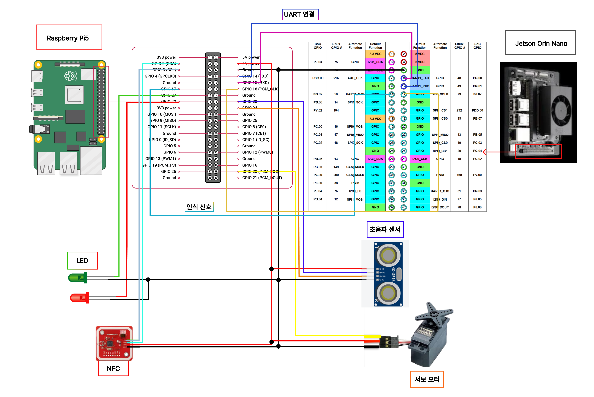
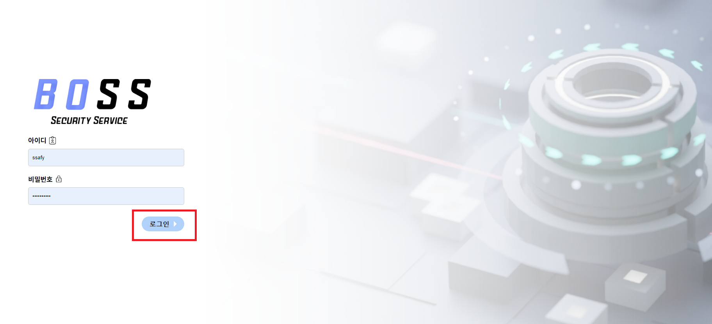
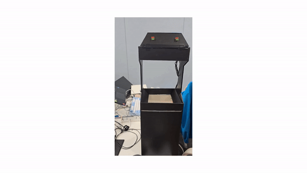
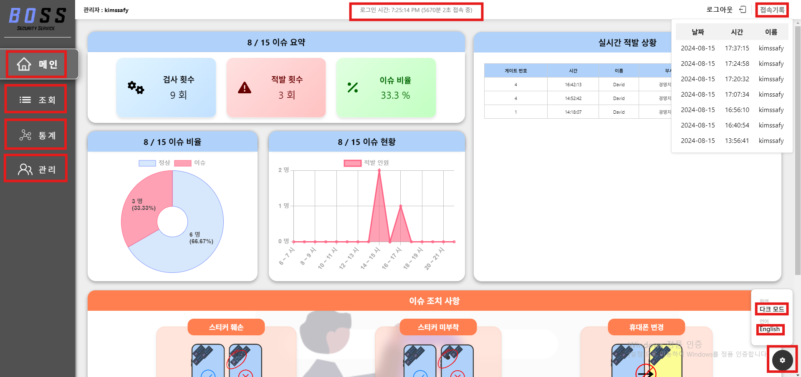
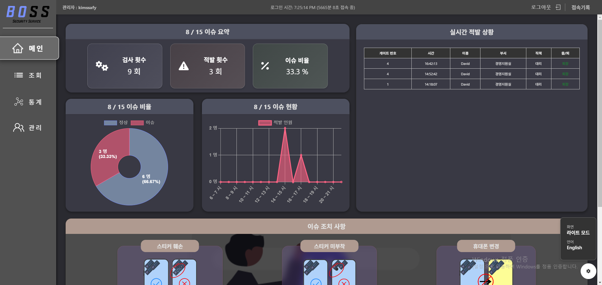
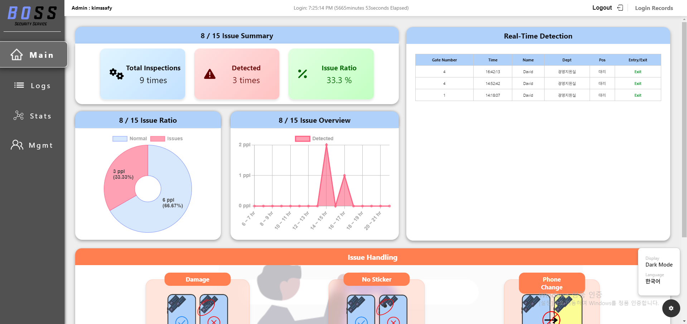
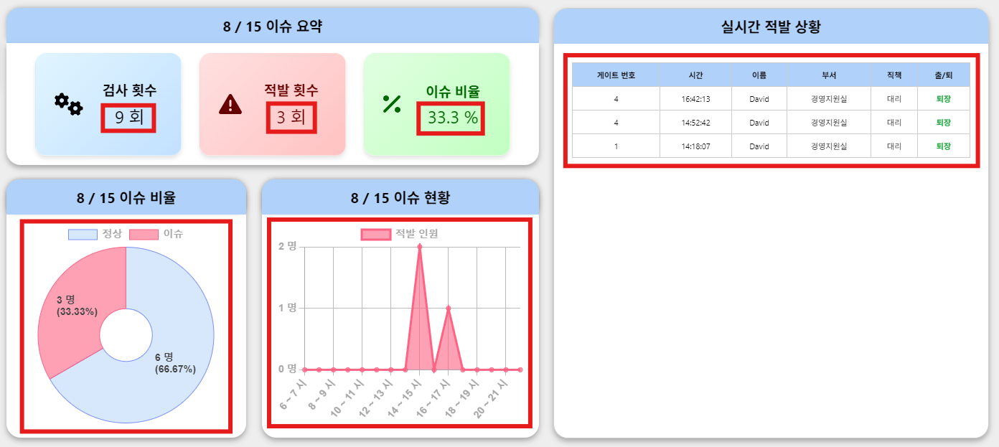
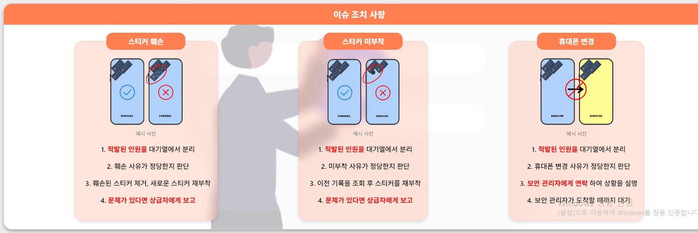
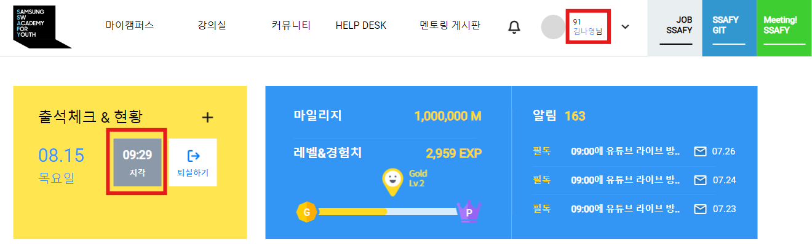

# 포팅 매뉴얼

## 1. Project Skill Stack Version

| Skill | Version |
| --- | --- |
| Java | 17 |
| SpringBoot | 3.3.1 |
| MySQL | 9.0.1(docker) |
| NPM | 10.8.1 |
| React | 18.3.1 |
| Python | 3.8.18 |
| Node.js | 20.15.1 |
| Anaconda | 24.5.0 |
| Jetpack(Jetson SDK) | 5.1.3 |
| Docker | 27.0.3 |
| Jenkins | 2.471 |
| Raspberry PI Kernel | 6.6.31 |
| Open CV | 4.10.0 |
| Cuda | 11.8.0 |
| Pythorch | 2.3.0 |
| Torchvision | 0.18.0 |

## 2. EC2 포트 번호

internal로 작성한 포트는 도커 네트워크 뒤에 존재하므로 임의 접근이 불가능함

| Skill | Port |
| --- | --- |
| Back | 8080(internal) |
| Front | 80(internal) |
| MySQL | 3306(internal) |
| NginX | 8888 |
| …추가 기입 |  |

## 3. 외부 프로그램

- **JIRA**: 프로젝트 관리 및 이슈 트래킹.
- **GitLab**: 소스 코드 관리 및 CI/CD.
- **Notion**: 문서 작성 및 협업 도구.
- **MatterMost**: 팀 채팅 및 커뮤니케이션.
- **Figma**: 디자인/목업 협업 도구.
- **Jenkins**: 자동화 빌드 및 배포 도구.

## 4. 빌드 방법

### 4.1. Back-End

- 빌드

```bash
gradle build
```

- 도커라이징

```bash
docker build -t <image-name>:<version> .
```

- 외부 라이브러리

```groovy
//	스프링부트 의존성
	implementation 'org.springframework.boot:spring-boot-starter-data-jpa'
	implementation 'org.springframework.boot:spring-boot-starter-web'
	implementation 'org.springframework.boot:spring-boot-starter-validation'
	implementation 'org.springframework.boot:spring-boot-starter-security'
	implementation 'org.springframework.boot:spring-boot-starter-websocket'
	implementation 'org.springframework.boot:spring-boot-devtools'
	
//	SQL 로그에 값을 주입해주는 의존성
	implementation 'com.github.gavlyukovskiy:p6spy-spring-boot-starter:1.9.1'

//	시큐리티
	implementation 'io.jsonwebtoken:jjwt-api:0.11.5'
	implementation 'io.jsonwebtoken:jjwt-impl:0.11.5'
	implementation 'io.jsonwebtoken:jjwt-jackson:0.11.5'

//	MySQL
	implementation 'com.mysql:mysql-connector-j'
	runtimeOnly 'com.mysql:mysql-connector-j'

//	유틸리티
	compileOnly 'org.projectlombok:lombok'
	annotationProcessor 'org.projectlombok:lombok'

//	매핑 자동화
//	documentation: https://mapstruct.org/documentation/1.5/reference/html/
	implementation 'org.mapstruct:mapstruct:1.5.5.Final'
	annotationProcessor 'org.mapstruct:mapstruct-processor:1.5.5.Final'
	testAnnotationProcessor 'org.mapstruct:mapstruct-processor:1.5.5.Final'
	implementation group: 'org.projectlombok', name: 'lombok-mapstruct-binding', version: '0.2.0'
	testImplementation group: 'org.projectlombok', name: 'lombok-mapstruct-binding', version: '0.2.0'

//  AWS S3
	implementation 'org.springframework.cloud:spring-cloud-starter-aws:2.2.6.RELEASE'

// https://mvnrepository.com/artifact/net.coobird/thumbnailator
	implementation group: 'net.coobird', name: 'thumbnailator', version: '0.4.1'

//	테스트 의존성
	testImplementation 'org.springframework.security:spring-security-test'
	testImplementation 'org.springframework.boot:spring-boot-starter-test'
	testRuntimeOnly 'org.junit.platform:junit-platform-launcher'
	testImplementation 'com.h2database:h2'
```

### 4.2. Front-End

- 도커라이징

```bash
docker build -t <image-name>:<version> .
```

- 환경변수 로드

```jsx
1. 프로젝트의 최상위 루트 디렉토리에 '.env' 파일 생성
2. '.env' 파일에 환경변수를 키-값 쌍으로 정의(각 줄에 하나씩 작성)
3. 키 이름은 대문자로 작성하고, 반드시 REACT_APP_으로 시작
	(REACT_APP_API_URL= ...)
4. npm install dotenv는 package.json에 있으므로 자연스럽게 설치됨
```

## 4.3 Infra

### 도커 설치

```bash
# https://docs.docker.com/engine/install/ubuntu/

# 패키지 제거
for pkg in docker.io docker-doc docker-compose docker-compose-v2 podman-docker containerd runc; do sudo apt-get remove $pkg; done

# Add Docker's official GPG key:
sudo apt-get update
sudo apt-get install ca-certificates curl
sudo install -m 0755 -d /etc/apt/keyrings
sudo curl -fsSL https://download.docker.com/linux/ubuntu/gpg -o /etc/apt/keyrings/docker.asc
sudo chmod a+r /etc/apt/keyrings/docker.asc

# Add the repository to Apt sources:
echo \
  "deb [arch=$(dpkg --print-architecture) signed-by=/etc/apt/keyrings/docker.asc] https://download.docker.com/linux/ubuntu \
  $(. /etc/os-release && echo "$VERSION_CODENAME") stable" | \
  sudo tee /etc/apt/sources.list.d/docker.list > /dev/null
sudo apt-get update

sudo apt-get install docker-ce docker-ce-cli containerd.io docker-buildx-plugin docker-compose-plugin
```

### NGINX 설치

```bash
sudo apt update
sudo apt install nginx

# SSL 설정
# https://certbot.eff.org/instructions?ws=nginx&os=ubuntufocal
sudo apt install snapd
sudo snap install certbot --classic
sudo ln -s /snap/bin/certbot /usr/bin/certbot
sudo certbot --nginx
```

### NGINX 설정

```
location / {
        proxy_pass http://localhost:8888;
        proxy_set_header Host $host;
        proxy_set_header X-Real-IP $remote_addr;
        proxy_set_header X-Forwarded-For $proxy_add_x_forwarded_for;
        proxy_set_header X-Forwarded-Proto $scheme;

        proxy_http_version 1.1;
        proxy_set_header Connection "";
}
```

### Docker Compose 실행

```bash
docker compose -f docker-compose.dev.yml up -d --build
```

## 4.4 Embedded

### 기기 결선도



### 공통 라이브러리 설치

```bash
# 시간 설정
sudo timedatectl set-timezone Asia/Seoul

# 패키지 최신판 유지
sudo apt update
sudo apt upgrade
sudo reboot

# gpio 설정
pip3 install rpi-lgpio 

# 원격 설치
sudo apt install xrdp
sudo systemctl status xrdp
sudo systemctl restart xrdp

# Uart 연결
pip install pyserial
# Pi 설정 변경하기 
sudo raspi-config
# Interfacing Options -> Serial -> NO -> Yes
```

### 라즈베리파이 라이브러리 설치

```bash
# nfc 라이브러리 다운
git clone https://github.com/hoanhan101/pn532.git

# Pi 설정 변경하기 
sudo raspi-config
# Interfacing Options -> I2C -> Yes

# nfc를 위한 'libnfc' 설치
sudo apt-get install libusb-dev libpcsclite-dev i2c-tools
cd ~
wget https://github.com/nfc-tools/libnfc/releases/tag/libnfc-1.7.1/libnfc-1.7.1.tar.bz2
tar -xf libnfc-1.7.1.tar.bz2 

# 컴파일
cd libnfc-1.7.1
./configure --prefix=/usr --sysconfdir=/etc
make
sudo make install 
cd /etc
sudo mkdir nfc

# 환경변수 설정
sudo nano /etc/nfc/libnfc.conf

```python
Check the following details of the file etc/nfc/libnfc.conf:
allow_autoscan = true
allow_intrusive_scan = false
log_level = 1
device.name = "_PN532_I2c"
device.connstring = "pn532_i2c:/dev/i2c-1"
```

### 젯슨 오린 나노 라이브러리 설치

[ros, opencv, pytorch, torchvision 설치 가이드](https://daftenp.notion.site/42eb4953b35643379928f71b079c4537?pvs=4)


```bash
# YOLOv8 설치
pip install ultralytics

# 원격 추가 설치
sudo apt-get install xfce4 -y
sudo vim /etc/xrdp/startwm.sh  # 13,14번 줄 주석 처리 후 다음 내용 추가
test -x /sur/bin/startxfce4 && exec /usr/bin/startxfce4
exec /bin/sh /usr/bin/startxfce4
```

## 5. 시연 시나리오


## 순서

1. 초기 상태
2. 기기 동작
3. 웹 페이지 변화

### 1. 초기 상태 (웹페이지)

### a. 로그인 화면



- **화면 구성** : 아이디와 비밀번호를 적을 수 있는 공간이 있고, 로그인 버튼이 있습니다.
- **설명** : 올바른 아이디와 비밀번호 입력 후 로그인을 누르면 관리자 페이지로 넘어갑니다.

### b. 관리자 페이지 - 메인 페이지


- **화면 구성**: 배포 사이트의 메인 페이지가 로드됩니다. 화면에는 다양한 메뉴(예: 메인, 조회, 통계, 관리)가 좌측에 배치되어 있으며, 로그아웃 버튼이 우측 상단에 위치해 있습니다. 우측 하단에는 다크모드와 언어를 변경할 수 있습니다.
- **특징**: 적발된 기록을 요약하여 좌측에 그래프와 함께 보여줍니다. 우측에는 실시간 적발 상황을 보여줍니다.

### c. 에듀싸피 로그인 전/후


- **화면 구성**: '에듀싸피' 로그인 페이지가 나타납니다. 이메일/패스워드 입력란과 로그인 버튼이 중심에 배치되어 있습니다.


- **화면 구성**: 이 화면은 로그인 후 상태이며, 보안 검색대에서 보안 검사를 통과하면 자동으로 입실체크가 됩니다.

### 2. 기기 동작 → 3가지 동작

1. **인식 → 아무 문제 없음**
    
    
    
    - **동작**: 사용자가 NFC 기기를 사용 후, 온전한 스티커가 부착된 휴대폰을 기기에 넣습니다.
    - **결과**: 인증 성공, 문이 열린 상태입니다. 모니터링 화면에서 성공 메시지가 나타납니다.
    - **화면 변화**: 배포 사이트의 관리자 페이지에 실시간으로 성공 기록이 추가됩니다.
2. **인식 → 보안 문제 발생**
    
    
    
    - **동작**: NFC 기기에 문제가 있는 휴대폰을 접촉하거나, 이미 사용된 스티커를 사용합니다.
    - **결과**: 인증 실패, 문이 닫힙니다. 모니터링 화면에서 실패 메시지가 나타납니다.
    - **화면 변화**: 관리자 페이지에 실패 기록이 실시간으로 추가됩니다.
3. **미인식**
    
    
    
    - **동작**: 사용자가 NFC 기기를 사용했지만, 보안검사가 끝나지 않았을 때 지나가려고 합니다.
    - **결과**: 초음파 센서가 사람을 감지해서 문이 닫힙니다.
    

### 3. 웹 페이지 변화

### a. 관리자 페이지 - 전체







- **화면 구성**: 관리자 페이지는 보안 직원이 보안 기록을 관리할 수 있는 페이지입니다. 메인, 조회, 통계, 관리 페이지로 구성됩니다.
- **특징**: 상단 Navbar에 관리자의 로그인 시간을 볼 수 있습니다. Navbar우측에는 관리자의 로그인 기록들을 볼 수 있습니다. 우측 하단에 톱니바퀴 버튼을 눌러서 다크모드와 언어 변경(영어) 기능을 이용할 수 있습니다.

### a-1. 관리자 페이지 - 메인 페이지





- **화면 구성**: 이슈 요약과 실시간 적발 상황 그리고 실시간 이슈 조치 사항 등으로 구성됩니다.
- **설명**:
    - **이슈 요약**: 오늘 날짜에 출입/퇴장 기록과 그 중 적발 횟수 그리고 이슈 현황을 나타냅니다.
    - **실시간 적발 상황**: Gate 검사에서 적발된 기록을 실시간으로 보여줍니다.
    - **이슈 조치 사항**: 관리자 입장에서 이슈 발생 시 조치 사항을 기술하였습니다.

### a-2. 관리자 페이지 - 조회 페이지


- **화면 구성**: 전체 이슈 로그 기록과 검색 옵션으로 구성됩니다.
- **설명**:
    - **검색 옵션**: 전체 로그 기록들 중 이름, 이용자 ID, 부서, 직책, 출/퇴, 보안 이슈, 시간별로 원하는 기록들만 검색할 수 있습니다.
    - **전체 이슈 로그**: DB에 저장된 모든 기록을 보여줍니다. 자세히 column에 아이콘을 누르면 검사 당시에 촬영된 휴대폰 사진을 볼 수 있습니다. 그 옆에 수정 column에 아이콘을 누르면 보안 이슈와 스티커 개수를 수정할 수 있습니다.

### a-3. 관리자 페이지 - 통계 페이지


- **화면 구성**: 출입 기록들을 통계를 내는 화면입니다. 통계 요약, 날짜별 통계, 통합 통계로 구성됩니다.
- **설명**:
    - **통계 요약**: 총 이용자, 적발 횟수, 검사 횟수, 하루 당 평균 적발 횟수 데이터를 보여줍니다.
        
        일, 주, 월, 년 단위로 선택해서 볼 수 있습니다.
        
    - **날짜별 통계**: 원하는 기간에 대한 적발 횟수와 통과 횟수를 볼 수 있습니다. X축은 06~22시로 시간에 따른 횟수데이터를 확인할 수 있습니다. 일, 주, 월, 년 단위로 선택해서 볼 수 있습니다.
    - **통합 통계**: Gate별, 부서별로 적발 횟수와 통과 횟수를 볼 수 있습니다. X축은 06~22시로 시간에 따른 횟수데이터를 확인할 수 있습니다. 일, 주, 월, 년 단위로 선택해서 볼 수 있습니다.

### a-4. 관리자 페이지 - 관리 페이지


- **화면 구성**: 현재 등록되어 있는 사원들을 관리하는 페이지 입니다. 사원을 등록할 수 도 있고 현재 등록 되어 있는 사람들을 검색할 수 도 있습니다.
- **설명**:
    - **등록 옵션**: 이름, 연락처, NFC, 프로필 사진, 부서, 직책을 입력하여 사원을 등록 할 수 있습니다.
    - **검색 옵션**: 사원들을 이름으로 검색할 수 있습니다.
    - **등록 인원 목록:** 등록된 사원들을 전체 조회하거나, 검색 조건에 맞게 조회 할 수 있습니다. 또한 프로필 사진을 볼 수도 있습니다.

### b. 에듀싸피 페이지




- **화면 구성**: 에듀싸피의 로그인 페이지에서 로그인 후 입실 상태가 확인됩니다.
- **설명**: 성공적으로 NFC를 인식한 사용자의 경우, 자동으로 입실 체크가 완료됩니다.

### 시연 시나리오

### a. 초기 화면 및 구성 요소 소개 (1분)

- **활동**: 배포 사이트 메인 페이지를 디스플레이하며, 주요 구성 요소를 간단히 소개합니다.
- **설명**: 이 시점에는 기록이 없음을 언급합니다.

### b. 휴대폰 시연 준비 및 디스코드 송출 전환

- **활동**: 디스코드 라이브 송출로 스크린 전환, 휴대폰을 NFC 기기에 접촉하여 3가지 상황(성공, 실패, 미인식)을 시연합니다.
- **설명**: 각 시나리오별 화면 변화를 보여줍니다.

### c. 시연 순서별 상세 설명 (1분 30초)

1. **성공 시나리오**
    - **화면**: 관리 페이지에서 성공 로그가 실시간으로 갱신됩니다.
    - **추가 설명**: 이미 시연된 내용을 다시 확인하면서, 성공 시나리오의 결과를 상세히 설명합니다.
2. **실패 시나리오**
    - **화면**: 실패 로그가 나타납니다. 스티커를 떼거나 재사용했을 때의 결과를 보여줍니다.
    - **추가 설명**: 도어가 닫히는 동작을 강조하여 시연합니다.
3. **미인식 시나리오**
    - **화면**: 미인식 로그가 관리자 페이지에 반영됩니다.
    - **추가 설명**: 인식 없이 통과할 때의 시스템 반응을 설명합니다.

### 시연 이후 웹페이지 상세 소개

- **활동**: 배포 사이트로 돌아가서 시연 중 발생한 결과를 실시간으로 확인합니다.
- **특징**: 다크 모드 및 영어 번역 기능을 소개하며, 조회 페이지에서 로그를 필터링하는 방법을 시연합니다.
- **기능 소개**: 각 로그에 첨부된 사진, 보안 이슈 해결, 스티커 개수 수정 등의 기능을 상세히 설명합니다.

### a. 에듀싸피 홈페이지 로그인 및 입실 확인

- **활동**: 시연에서 사용한 memberId로 에듀싸피에 로그인하여, 자동으로 완료된 입실 체크를 확인합니다.
- **화면**: 입실 기록이 정상적으로 표시됨을 보여줍니다.

### b. 통계 페이지 소개

- **활동**: 출입 기록 데이터 기반 통계를 확인합니다.
- **화면**: 다양한 통계 차트 및 그래프를 통해 출입 패턴 분석이 가능함을 설명합니다.

## 6. Trouble shooting

### apt update 속도 문제

```bash
# 스크립트 다운
curl -Ss https://gist.githubusercontent.com/lesstif/8
 185f143ba7b8881e767900b1c8e98ad/raw/b749a8fc590ad2391
 fd0f8849417eeec998b33a7/change-ubuntu-mirror.sh -o ch
 ange-ubuntu-mirror.sh
 
# 실행 권한 부여
chmod +x change-ubuntu-mirror.sh

# 루트 권한으로 실행
sudo ./change-ubuntu-mirror.sh

# 3개 서버 중 하나 선택
# 카카오 사용
sudo bash ./change-ubuntu-mirror.sh -k

# kaist 사용
sudo bash ./change-ubuntu-mirror.sh -n

# 부경대 사용
sudo bash ./change-ubuntu-mirror.sh -a
```

### import cv2 오류

```bash
export LD_PRELOAD=/usr/lib/aarch64-linux-gnu/libgomp.so.1
```